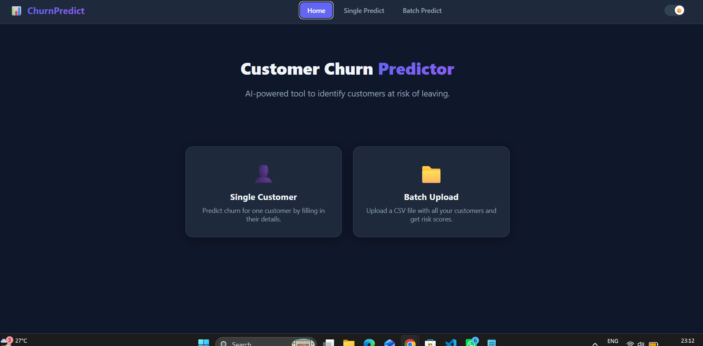
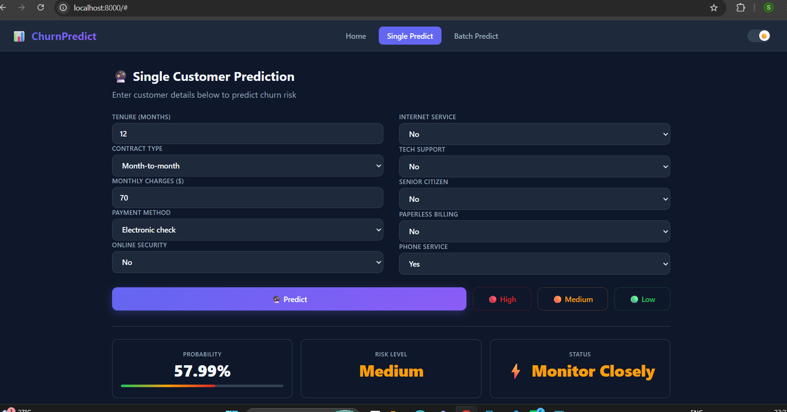
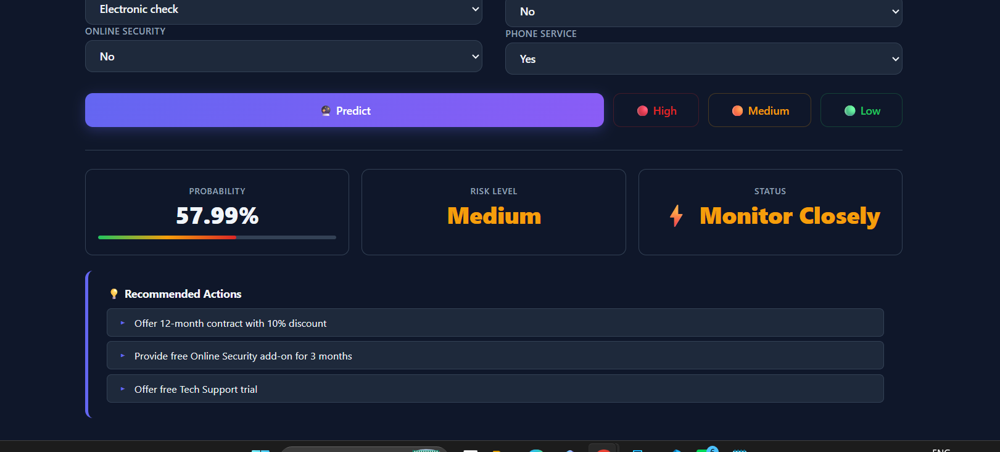
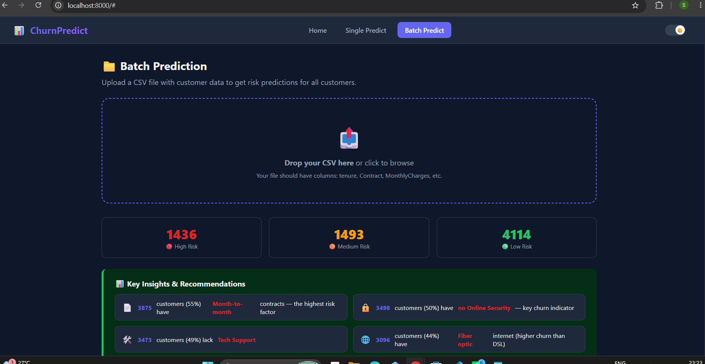
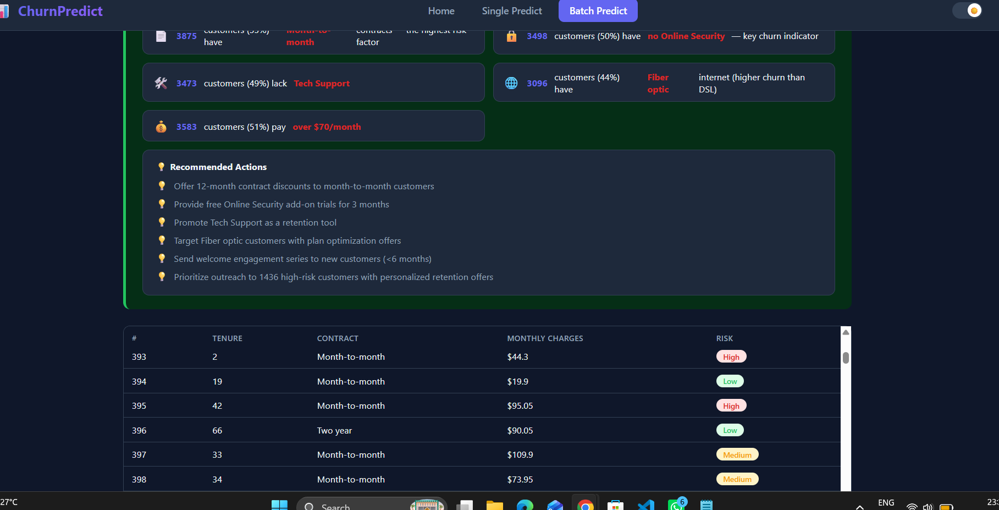
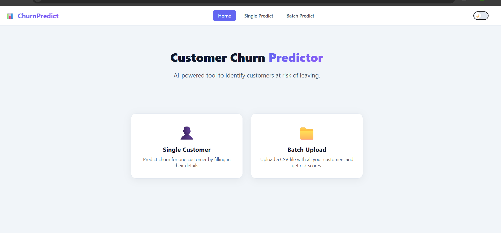
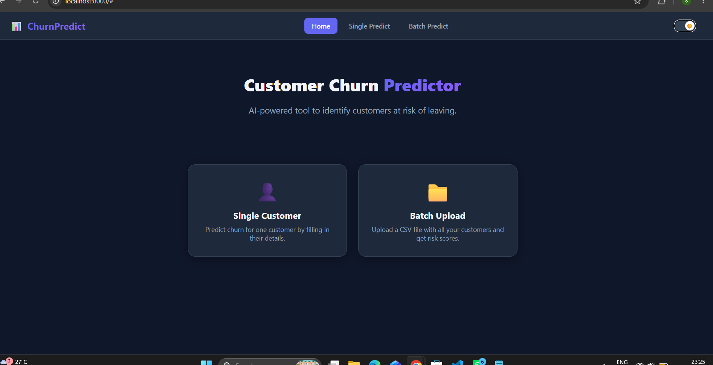

# 📊 Customer Churn Prediction

An end-to-end machine learning application that predicts customer churn for telecommunications companies. This tool helps businesses identify at-risk customers, understand why they might leave, and take proactive retention actions.

---

## 🚀 Live Demo

## 📸 Screenshots

### Home Page

### Single Prediction

### Batch Upload

### Light Mode

### Dark Mode

---

## ✨ Features

| Feature | Description |
|---------|-------------|
| 🔮 **Single Customer Prediction** | Enter customer details and get instant churn risk score with recommendations |
| 📁 **Batch Upload** | Upload a CSV file with hundreds of customers and get risk scores for all |
| 📊 **Key Insights** | Automatic analysis showing why customers are at risk (Contract type, Online Security, etc.) |
| 💡 **Actionable Recommendations** | Get specific business actions to prevent churn |
| 🌙 **Dark/Light Mode** | Toggle between themes for comfortable viewing |
| 🤖 **AI-Powered** | Uses XGBoost with SHAP explanations for model interpretability |

---

## 🛠️ Tech Stack

### Backend
- **Flask** — REST API
- **XGBoost** — Machine Learning model
- **Scikit-learn** — Data preprocessing & model pipeline
- **SHAP** — Model interpretability
- **Pandas & NumPy** — Data manipulation

### Frontend
- **HTML5** — Structure
- **CSS3** — Styling with Dark/Light mode
- **Vanilla JavaScript** — Interactivity & API calls

### Deployment
- **Git & GitHub** — Version control
- **Render** — Deployment (optional)

---

## 🏗️ Project Structure
churn_predict/
│
├── backend/
│ └── app.py # Flask API with prediction endpoints
│
├── frontend/
│ └── index.html # Single-page web interface
│
├── models/
│ ├── aggressive_best_model.pkl # Trained XGBoost model
│ └── preprocessor.pkl # Preprocessing pipeline
│
├── data/
│ └── (your CSV files) # Sample datasets
│
├── .gitignore
├── requirements.txt
├── runtime.txt
├── setup.py
└── README.md

---

## 📊 Model Performance

| Metric | Score |
|--------|-------|
| **Accuracy** | 77.3% |
| **Recall** | 73.5% |
| **Precision** | 55.6% |
| **F1-Score** | 0.63 |

### Top Predictors of Churn

1. **Contract Type** — Month-to-month customers are 13x more likely to churn
2. **Tenure** — Customers with less than 6 months tenure are at highest risk
3. **Online Security** — Missing security increases churn risk
4. **Tech Support** — Lack of support correlates with higher churn
5. **Monthly Charges** — Higher bills (> $70) increase churn probability

---

The dataset used is the IBM Telco Customer Churn dataset, which contains:

7,032 customers
20 features
~26.5% churn rate

Key Columns
Column	Description
tenure	Months the customer has been with the company
Contract	Month-to-month, One year, or Two year
MonthlyCharges	Amount charged to the customer monthly
OnlineSecurity	Whether the customer has online security
TechSupport	Whether the customer has tech support
Churn	Target variable (Yes/No)
-------------------------------------------------------------------------
Key Insights Feature
When you upload a CSV for batch prediction, the app automatically analyzes the data and shows:

-Contract Analysis — How many customers are on month-to-month contracts
-Security Gaps — How many lack Online Security or Tech Support
-Pricing Analysis — How many pay over $70/month
-Tenure Analysis — How many are new customers (<6 months)
-Service Analysis — Internet service type distribution

Based on these insights, the app generates automated recommendations for the business.

--------------------------------------------------------------------------

🏆 Key Learnings
This project was built as a second-year data science project and demonstrates:

End-to-end machine learning pipeline
Feature engineering for business problems
Handling class imbalance with SMOTE
Model interpretability with SHAP
Web deployment with Flask
Interactive frontend development
Batch processing for large datasets

----------------------------------------------------------------------------

🔗 Links
Link	URL
GitHub Repository  	https://github.com/Sanjana24-18/Churn_predict
Dataset	   https://www.kaggle.com/datasets/blastchar/telco-customer-churn

📄 License
This project is for educational purposes.

👨‍💻 Author
Sanjana — GitHub

🙏 Acknowledgments
IBM for the Telco Customer Churn dataset
Kaggle for hosting the dataset
Scikit-learn, XGBoost, and SHAP libraries

